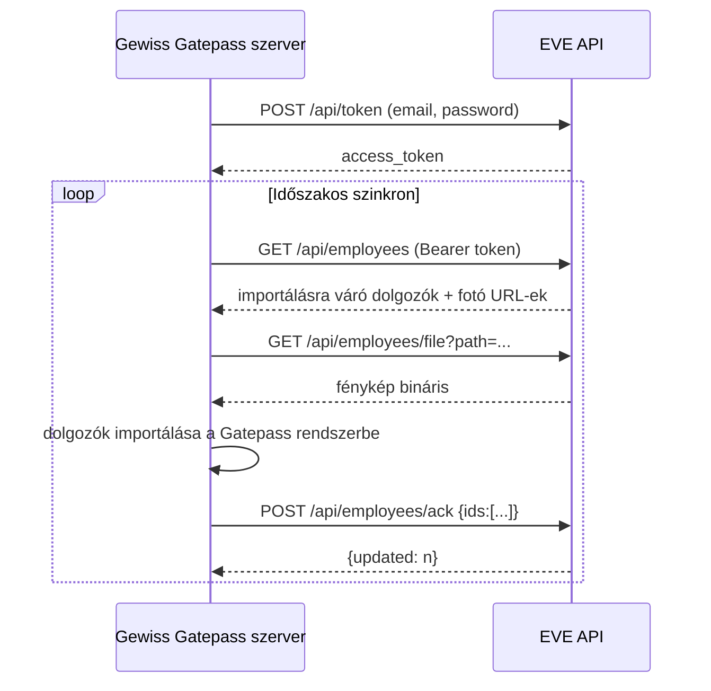

Az API a helyi **Gewiss Gatepass szervernek** ad hozzáférést a rögzített, importálásra váró dolgozói adatokhoz. Minden végpont `Content-Type: application/json` választ ad, és a `CorsMiddleware` + `RateLimitMiddleware` páron megy keresztül, a védett végpontok pedig `ApiAuthMiddleware`-en is.

## Autentikáció

### 1. Token igénylése

<CodeGroup>
```bash cURL
curl -X POST http://localhost:8000/api/token \
  -H 'Content-Type: application/json' \
  -d '{"email":"user@example.com","password":"very-secure-password"}'
```
```json Válasz 200
{
  "token_type": "Bearer",
  "access_token": "eyJhbGciOiJIUzI1NiIs...",
  "expires_in": 3600
}
```
```json Válasz 401
{ "error": "Invalid credentials" }
```
</CodeGroup>

A tokent a `JwtService::issue()` állítja ki: HS256, `iss`/`aud`/`iat`/`nbf`/`exp`/`sub` (felhasználó ID)/`jti` claimekkel, a `security.jwt_secret` titokkal aláírva. Az élettartam a `JWT_TTL` (`.env`) alapján állítható, alapértelmezetten 3600 mp.

<Warning>
  A JWT visszavonás **nincs beépítve**. Ha egy tokent kompromittáltnak gyanítasz, a felhasználó jelszavának cseréje nem érvényteleníti a már kiadott, még le nem járt tokeneket. Tarts rövid TTL-t, és szükség esetén vezess be külön token blacklistet.
</Warning>

### 2. Token használata

Minden védett végpont `Authorization: Bearer <token>` fejlécet vár (`Request::bearerToken()` a `^Bearer\s+(\S+)$` mintát illeszti). Az `ApiAuthMiddleware` dekódolja a JWT-t, ellenőrzi, hogy a `sub` claimhez tartozó felhasználó még létezik-e, és a felhasználó ID-t a `$_SERVER['API_USER_ID']` kulcsban teszi elérhetővé a controllernek. Érvénytelen/lejárt token vagy törölt felhasználó esetén `401`.

```bash
curl http://localhost:8000/api/me \
  -H 'Authorization: Bearer YOUR_TOKEN'
```

## Végpontok

### `GET /api/me`

A tokenhez tartozó felhasználó adatai (`id`, `name`, `email`, `phone`, `role`, `created_at`).

```json
{ "data": { "id": 1, "name": "...", "email": "...", "phone": null, "role": "admin", "created_at": "..." } }
```

### `GET /api/employees`

Az összes **importálásra váró** (`imported_at IS NULL`) dolgozó, létrehozási sorrendben. A `photo`/`avatar` relatív tárolási útvonalak helyett teljes, letölthető URL-t ad vissza (`ApiController::fileUrl`), ami a `/api/employees/file?path=...` végpontra mutat.

```json
{
  "data": [
    {
      "id": 42,
      "employee_code": "AB1234",
      "contractor_id": 1,
      "subcontractor_id": 2,
      "fullname": "Kovács János",
      "idcard": "123456AB",
      "photo": "http://localhost:8000/api/employees/file?path=6f1a...jpg",
      "avatar": "http://localhost:8000/api/employees/file?path=6f1a..._avatar.jpg",
      "created_by": 1,
      "imported_at": null,
      "created_at": "...",
      "updated_at": "..."
    }
  ]
}
```

<Note>
  Ez a végpont **nincs** a hívó felhasználó `accessScope`-jához igazítva — minden importálásra váró dolgozót visszaad, függetlenül attól, hogy melyik felhasználó rögzítette. A scope-szűrés csak a webes felületen (`EmployeeController::index`) érvényesül. Ha a Gatepass integrációnak felhasználónkénti szűrésre is szüksége lenne, ezt itt még be kell vezetni.
</Note>

### `GET /api/employees/file?path=<fájlnév>`

Egy korábban visszakapott `photo`/`avatar` URL-ből kinyert **fájlnevet** (nem teljes útvonalat) vár a `path` paraméterben. A controller `basename()`-mel és `realpath()`-os prefix-ellenőrzéssel zárja ki a könyvtár-bejárásos (`../`) próbálkozásokat, mielőtt a `storage/uploads/employees/` alól kiszolgálná a fájlt. `.png` kiterjesztésnél `image/png`, egyébként `image/jpeg` content type.

### `POST /api/employees/ack`

A Gatepass szerver ezzel jelzi vissza, hogy mely dolgozókat importálta sikeresen — ezek után a rekordok `imported_at` mezője beállításra kerül, és a webes felületen szerkeszthetetlenné válnak.

```bash
curl -X POST http://localhost:8000/api/employees/ack \
  -H 'Authorization: Bearer YOUR_TOKEN' \
  -H 'Content-Type: application/json' \
  -d '{"ids":[42, 43, 44]}'
```

```json
{ "updated": 3 }
```

<Info>
  A visszaadott `updated` szám az elküldött ID-k száma, **nem** a ténylegesen módosított sorok száma — nem létező vagy már importált ID-k csendben figyelmen kívül maradnak az `UPDATE ... WHERE id IN (...)` lekérdezésben, de a válasz szám ettől nem csökken.
</Info>

## Tipikus integrációs folyamat



## Rate limit és CORS

- **Rate limit**: fájlalapú számláló IP + útvonal + időablak kulccsal (`storage/cache/rl_*`), alapértelmezetten 60 kérés / 60 mp (`RATE_LIMIT_MAX`, `RATE_LIMIT_WINDOW`). Túllépéskor `429 Too many requests`, és minden válasz tartalmazza az `X-RateLimit-Limit` / `X-RateLimit-Remaining` fejléceket. Ez **egygépes** megoldás — több PHP-FPM/webszerver példány esetén nem konzisztens, Redis-alapú limiter javasolt helyette.
- **CORS**: csak a `CORS_ALLOWED_ORIGINS` (`.env`, vesszővel elválasztott lista) között szereplő originek kapnak `Access-Control-Allow-*` fejléceket; `OPTIONS` preflight kérésre a middleware `204`-gyel zár, mielőtt bármi más lefutna.
